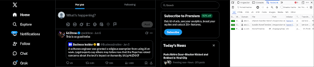
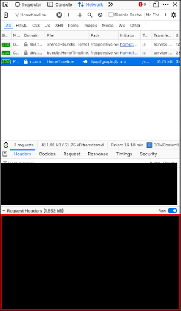
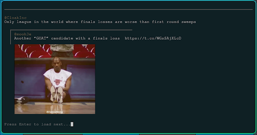

# Twitter Command Line Interface

A command line interface written in c for browsing your twitter feed in graphically accelerated terminals like ghostty and kitty

## Set up

### Building

```bash
# Clone repo
git clone https://github.com/gxddi/twitter-cli

cd twitter-cli

gcc src/main.c src/fetch.c src/image.c src/tweet.c -lcurl -lcjson -lm -o build/twitter

```

Requirements:
- libcurl, cjson and gcc

### Credentials

1. Open developper tools in your browser
2. Navigate to the "Network" tab
3. Refresh on your twitter timeline
4. Search for "HomeTimeline"



5. Scroll down to your request headers
6. Copy the variables from the request headers that are required into credentials.conf.

Request headers should look something like this:
```
POST /i/api/graphql/*HERE*/HomeTimeline HTTP/2
Host: x.com
User-Agent: 
Accept: */*
Accept-Language: en-US,en;q=0.9
Accept-Encoding: gzip, deflate, br, zstd
Content-Type: application/json
Content-Length: 2220
Referer: https://x.com/home
x-twitter-auth-type: OAuth2Session
x-csrf-token: *HERE*
x-twitter-client-language: en
x-twitter-active-user: yes
x-client-transaction-id: *HERE*
authorization: *HERE*
Connection: keep-alive
Cookie: __cuid=; g_state=; kdt=; dnt=; guest_id=; twid=*HERE*; ct0=; auth_token=*HERE*; d_prefs=; __cuid=; lang=; __cf_bm=*HERE*
```



## Examples

```bash
# View your twitter feed in your terminal
./build/twitter
```




## Why I made it
1. Browse twitter without trackers or unnecessary distractions
2. Maintain a static feed without inducing changes in the algorithm
3. For fun (Please feel free to contribute)

## TBA
1. Recording seen tweets
2. Support for GIFs
3. Support for other platforms
4. Build spec
